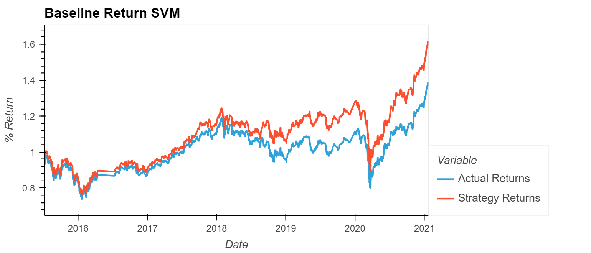
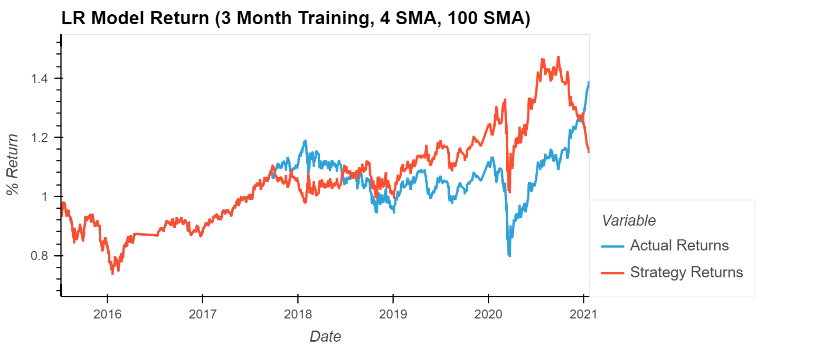
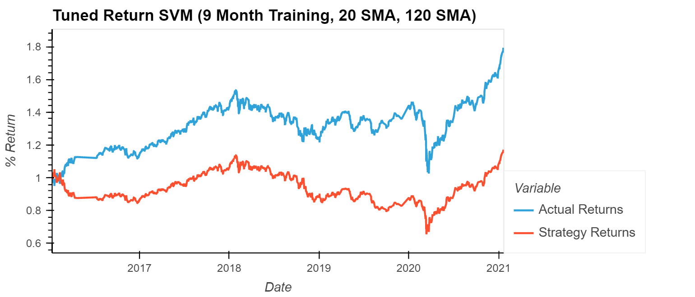
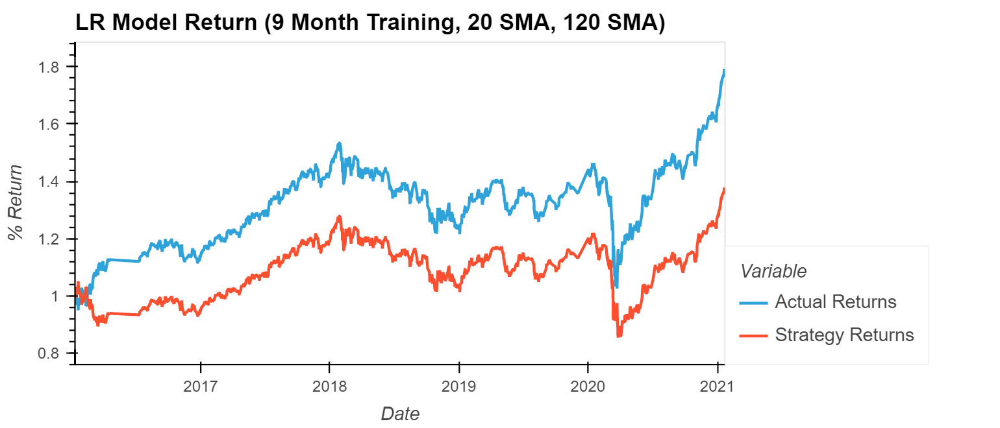

# ML_TradingBot

Trading Algorithm created using a simple short sell and long buy algorithm using a SVC and a Linear Regression Machine Learning Models.

---

## Technologies

This project uses python 3.7 along with jupyter lab 3.0.14 with the following packages:


* [pandas](https://github.com/pandas-dev/pandas) - For data manipulation and analysis

* [sklearn](https://scikit-learn.org/stable/) - To split, scale, model, and analyse datasets

* [hvplot](https://hvplot.holoviz.org/) - For data visualization


---

## Installation Guide

Before running the application first install the following dependencies:

```python
$ pip install pandas
$ pip install -U scikit-learn
$ conda install -c pyviz hvplot
```

---

## Usage

Original Baseline Model was created using a SVC ML model with a 4- and 100-day SMA and 3 Months of Training Data.

Alternative Model using a Logistic Regression and Baseline Inputs

It can be seen that the Logistic Regression Model ended up performing poorly at the end when compared to the SVC model. After going through a series of tuning with the original SVC model it seems that the performance at 9-Months of training data with 20- and 120-day SMAs performed the best. Surprising both of the ML models performed similarly with these tuned inputs. As can be seen in the following images of the two ML models performance.




---

## Contributors

Deep Patel -- Deep4Patel9@gmail.com

---

## License

MIT License
