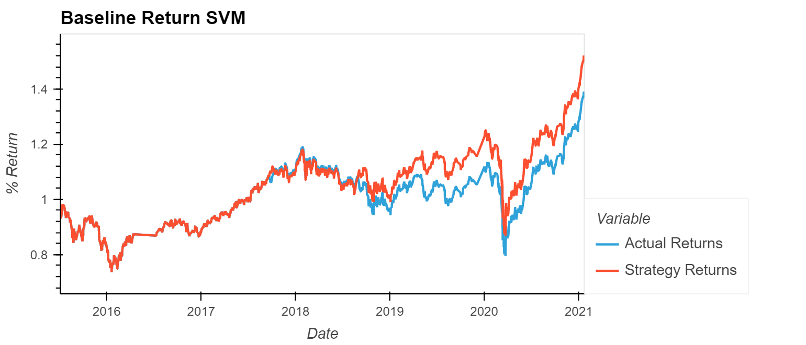

# ML_TradingBot

Trading Algorithm created using a simple short sell and long buy algorithm using a SVC and a Linear Regression Machine Learning Models.

---

## Technologies

This project uses python 3.7 along with jupyter lab 3.0.14 with the following packages:


* [pandas](https://github.com/pandas-dev/pandas) - For data manipulation and analysis

* [sklearn](https://scikit-learn.org/stable/) - To split, scale, model, and analyse datasets

* [hvplot](https://hvplot.holoviz.org/) - For data visualization


---

## Installation Guide

Before running the application first install the following dependencies:

```python
$ pip install pandas
$ pip install -U scikit-learn
$ conda install -c pyviz hvplot
```

---

## Usage

Original Baseline Model was created using a SVC ML model with a 4- and 100-day SMA and 3 Months of Training Data.


---

## Contributors

Deep Patel -- Deep4Patel9@gmail.com

---

## License

MIT License